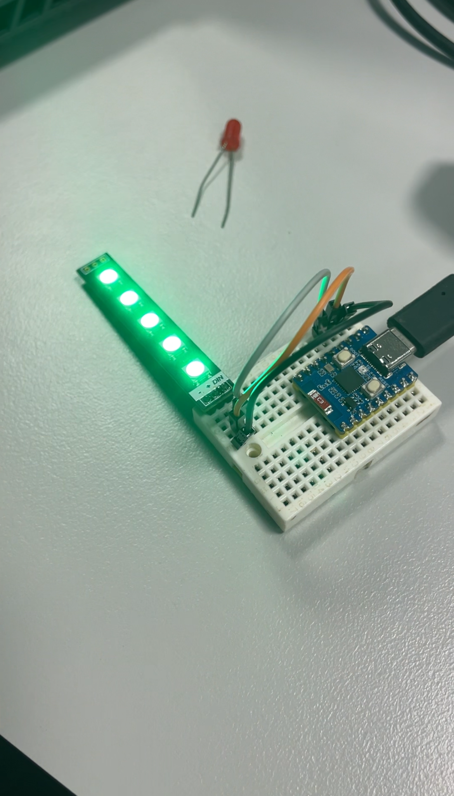
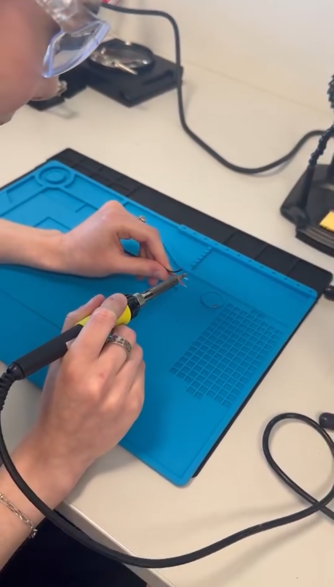

# Process Journal - Angelique Haynes (1184477), Group: Jade and Sandikshya,  Project: Mood Bracelet
This process journal documents the iterative development of a wearable prototype for Task 2 and Task 3. The idea for the project created in cooperation with my group for these tasks is the 'Mood Bracelet'. The project explores how responsive technology can support emotional awareness by translating physiological signals, specifically heart rate, into intuitive mood feedback. Across Weeks 6 to 8, I applied iterative design principles by continuously refining the concept, logic, research and reflection. Each stage involved purposeful improvements and adjustments: from shifting away from manual mood input to implementing automated detection using rolling averages for heart rate, to refining LED feedback for emotional clarity. 

---
## Table of Contents
- [Week 6: Concept Exploration and Initial Design](#week-6-concept-exploration-and-initial-design)
- [Week 7: Functional Planning and Core Coding](#week-7-functional-planning-and-core-coding)
- [Week 8: Presentation Development and Journal Framing](#week-8-presentation-development-and-journal-framing)
- [Week 9: Setup and Bluetooth Communication](#week-9-setup-and-bluetooth-communication)
- [Week 10: LED Feedback Prototyping with ESP32](#week-10-led-feedback-prototyping-with-esp32)
- [Week 11: Transition to Micro:bit and Emotional Display](#week-11-transition-to-microbit-and-emotional-display)
- [Week 12: Pulse Sensor Integration and Design Refinement](#week-12-pulse-sensor-integration-and-design-refinement)
- [Week 13: Hardware Debugging and Aesthetic Refinement](#week-13-hardware-debugging-and-aesthetic-refinement)
- [Week 14: Final Prototype Assembly and Video Demonstration](#week-14-final-prototype-assembly-and-video-demonstration)

---

## Week 6: Concept Exploration and Initial Design
Focus: Exploring the concept of responsive technology and brainstorming ideas for a wearable prototype.

Activities Completed
- Reviewed course materials and examples of context and wearable technologies.
- Brainstormed initial ideas for a bracelet that responds to emotional states.
- Researched similar projects.
- Sketched a prototype design.
- Identified potential use cases: emotional regulation, stress tracking.
- Began researching micro:bit capabilities.
- Developed JavaScript code in Microsoft MakeCode to simulate BPM readings.
- Created conditional logic to log “Stressed” or “Calm” based on BPM thresholds.
- Designed LED feedback icons for each mood state.

SKETCH OF THE MOOD BRACELET:

  

 
 
 
 
 

Reflections: I was inspired by the idea of mood jewellery and combining emotional states that are visible and trackable. Most wearables focus on fitness, but I wanted something that supports reflection. This week I also found my group; Jade and Sandikshya. We all agreed on the idea and the direction of the project from the combination of our own individual research into the topic.

 
 
 
 
---

## Week 7: Functional Planning and Core Coding
Focus: Refining the bracelet’s functionality and beginning planning the technical implementation. As well as, coding the core code for heart rate monitoring, spike detection, and mood logging.

- Two bracelet modes: Calm represented as the colour blue and stressed represented as the colour red.

- Mood Detection Mode – Automatic mood logging that would be detecting heart rate every 10-15 seconds.

- Spike Logging Mode – Detects and stores heart rate spikes throughout the day.

- Reflection Mode – End-of-day summary showcasing any major heart rate spikes.

- Selected micro:bit V2 as the controller for its built-in sensors and MakeCode compatibility.

- Explored wearable assembly options using conductive thread and soft materials/fabrics.

JAVA BLOCK IN MAKECODE & JAVA CODE IN MAKECODE:

  
  

 
 
 
 
 
 

Reflections: Automating mood detection based on BPM changes simplifies the user experience and makes the bracelet more responsive. I decided to log “Stressed” if BPM exceeds the rolling average by 15%, and “Calm” otherwise. I also created code in makecode of both block form and javascript as seen above. I am unsure whether this code works or does not as I haven't gained access to a micro:bit yet, but the main structure of code is complete and can be worked on if needed during the next step of the prototype making process for Task 3.

---

## Week 8: Presentation Development and Journal Framing
Focus: Start and completion of PowerPoint and Script components.

Activites completed this week with group members:

- Developed the PowerPoint and completed, checks off all points from the rubric.
- Created basic script and continuing to work on it such as adding details; in a collaborative workspace.
- Wrote introduction paragraph for this journal.

POWERPOINT PRESENTATION CREATED IN CANVA:

  

 

Reflections: This week, our group successfully completed the PowerPoint presentation, ensuring it aligned with all rubric requirements for content, clarity, and visual design. We also began drafting the presentation script in a shared workspace, allowing for real-time collaboration and ongoing refinement. The script currently covers key points and is being expanded with transitions and supporting detail. Additionally, I wrote the introduction paragraph for this journal to frame our progress and set the tone for reflective documentation.

---

## Week 9: Setup and Bluetooth Communication
Focus: This week focused on initiating the hardware development of the wearable prototype using the ESP32 microcontroller. I also explored theoretical frameworks such as Human-Computer Interaction (HCI) and embodied cognition to inform the design.

Technical Progress:
- Programmed the ESP32 to serve as the core of the wearable bracelet.
- Implemented Bluetooth communication protocols to enable wireless data exchange between the bracelet and a mobile/web interface.
- Began testing connectivity and responsiveness of the ESP32 in a wearable context.

Conceptual Development: 
- Considered how the bracelet could respond to both environmental and physiological data to support wellbeing.
- Reflected on embodied cognition and how physical sensations (e.g. stress, calm) could be translated into wearable feedback.

 

Reflections: Bluetooth integration was a foundational step that enabled real-time interaction. The theoretical lens of embodied cognition reinforced the importance of designing for both emotional and physical responsiveness in high-stress environments.

---

## Week 10: LED Feedback Prototyping with ESP32
Focus: This week I explored visual feedback mechanisms using LED lights controlled by the ESP32 to represent emotional states or environmental triggers.

Technical Progress
- Programmed LED light patterns (e.g. soft green for calm, flashing red for stress).
- Tested brightness, colour, and responsiveness to simulated input.
- Evaluated the feasibility of integrating LEDs into the bracelet design.

 

Reflections: LEDs provided a simple and intuitive feedback method. However, I noted challenges with visibility in bright environments and power consumption. This experimentation helped clarify the need for a more expressive and integrated display solution.

LED LIGHTS - GREEN & RED:

  
  

---

## Week 11: Transition to Micro:bit and Emotional Display
Focus: After evaluating the limitations of the ESP32 for visual output, I transitioned to using the micro:bit for its built-in LED lights and simplified programming environment.

Technical Progress:
- Reprogrammed the prototype using the micro:bit.
- Created emotive icons on the LED matrix: a happy face for calm and a sad face for stress.
- Mapped emotional states to sensor input thresholds.

 

Reflections: The micro:bit’s built-in display offered a more compact and expressive solution than external LEDs. This shift improved the bracelet’s usability and streamlined the design, making it more suitable for real-world deployment.

---

## Week 12: Pulse Sensor Integration and Design Refinement
Focus: This week focused on integrating physiological sensing and finalising the physical layout of the bracelet.

Technical Progress:
- Integrated a pulse sensor with the micro:bit and merged it with the existing emotional display code.
- Conducted placement tests and determined that the pulse sensor must be positioned under a finger (not on the wrist) for accurate readings.
- Adjusted the bracelet design to accommodate this requirement, considering modular or clip-on extensions.

 

Reflections: Integrating the pulse sensor brought the project full circle, enabling the bracelet to respond to real-time physiological data. This final integration phase clarified the physical constraints of the design and informed a more user-friendly and accurate layout.

SOLDERING:

  

---

## Week 13: Hardware Debugging and Aesthetic Refinement
Focus: This week focused on resolving hardware issues with the pulse sensor and exploring aesthetic enhancements for the wearable design.

Activities Completed
- Rewired the micro:bit to the pulse sensor using soldering for improved stability and signal integrity.
- Identified and corrected errors in the code that were affecting sensor readings.
- Diagnosed potential connection issues with the pulse sensor, possibly due to inconsistent contact or voltage fluctuations.
- Explored the use of a jewellery-style chain to enhance the bracelet’s visual appeal and wearability.

 

Reflections: Troubleshooting the sensor connection was a critical step in ensuring reliable data capture. Soldering improved the physical connection, and debugging the code helped restore accurate pulse readings. The idea of using a jewellery chain adds a layer of aesthetic value, making the bracelet more appealing and wearable in public or professional settings. This week balanced technical refinement with design thinking, moving the project closer to a polished prototype.

SHRINKING:

  
  

---

## Week 14: Final Prototype Assembly and Video Demonstration
Focus: Completing the final prototype and preparing the video demonstration for Task 3 submission.

Activities Completed
- Debugged and corrected LED display code to ensure accurate mood representation.
- Replaced a faulty pulse sensor to have reliable heart rate detection.
- Brought in all required equipment and assembled the final wearable prototype.
- Collaboratively worked on the demonstration video script with group members.
- Filmed multiple video clips, showcasing the bracelet’s functionality and user interaction.
- Began editing footage for the final demonstration video.

 

Reflections: This week marked the completion of our design and development process. Fixing the LED lights logic and replacing the pulse sensor ensured the prototype functioned as intended. Assembling the final bracelet and filming the demonstration helped us reflect on how far the project had come, from just a concept to a working responsive wearable. The video will serve as a clear and engaging showcase of our work and its real-world potential.

DEBUGGED AND CORRECTED CODE:

  

FINAL SHRINKING:

  

FINAL PROTOTYPE:

  

